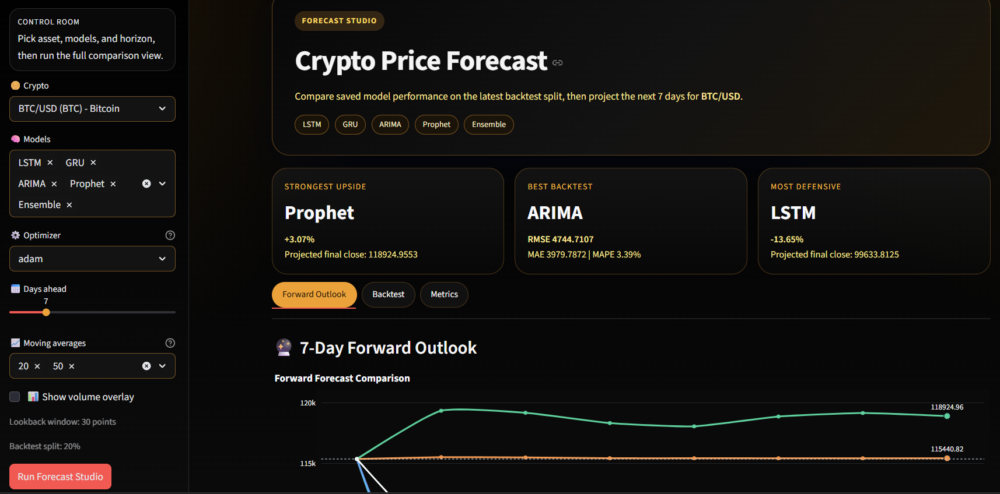

# ₿ Crypto Price Forecast ML

Lightweight ML project for cryptocurrency price forecasting with CLI and Streamlit.

## 🚀 What This Project Does
- Loads historical crypto data from `data/crypto_statistics_data.csv`
- Engineers technical indicators:
  - `EMA`, `MA`, `RSI`
  - `MACD`, Bollinger Bands
  - Volatility features
- Trains multiple forecasting models and saves artifacts to `results/`
- Compares model performance using backtest metrics

## 🧠 Models
- `LSTM` (TensorFlow/Keras)
- `GRU` (TensorFlow/Keras)
- `ARIMA` (statsmodels)
- `Prophet` (optional, if installed)
- `Ensemble` (mean of available base-model predictions)

## ⚙️ Training Setup
- Optimizers for sequence models: `adam`, `rmsprop`
- Sequence model training config (`src/train.py`):
  - Epochs: `5`
  - Batch size: `128`
  - Validation split: `0.1`

## 📁 Project Structure
- `main.py` - CLI entrypoint
- `src/data.py` - data loading and feature engineering
- `src/models.py` - model definitions and builders
- `src/train.py` - training pipeline, evaluation, artifact writing
- `src/streamlit.py` - dashboard app
- `results/` - `.keras` and `.json` artifacts

## 🛠️ Quick Start
1. Create a virtual environment:
   `python -m venv .venv`
2. Activate in PowerShell:
   `.venv\Scripts\Activate.ps1`
3. Install dependencies:
   `pip install -r requirements.txt`
4. Train all models:
   `python main.py --run-pipeline --models all`

## ▶️ Run the App
- CLI menu:
  `python main.py`
- Streamlit dashboard:
  `streamlit run src/streamlit.py`
- Suggested workflow:
  - Run training once to generate/update artifacts in `results/`
  - Launch Streamlit to inspect forecasts and compare model outputs
- Output locations:
  - Trained model files (`.keras`) and metadata (`.json`) are written to `results/`
  - The app reads from saved artifacts to visualize predictions and metrics

## 📊 Metrics
- The training/evaluation pipeline reports:
  - `RMSE` (Root Mean Squared Error)
  - `MAE` (Mean Absolute Error)
  - `MAPE` (Mean Absolute Percentage Error)
- Lower values indicate better predictive performance
- Use all three together for a balanced view:
  - `RMSE` penalizes larger misses more heavily
  - `MAE` shows average absolute error in a stable way
  - `MAPE` gives percentage-based error for easier relative comparison

## 📝 Notes
- Prophet is optional; training skips it automatically when unavailable.
- TensorFlow-backed models (`LSTM`, `GRU`) may take longer depending on hardware.
- Ensure `data/crypto_statistics_data.csv` exists before running the pipeline.
- If artifacts already exist in `results/`, retraining will overwrite model outputs.
